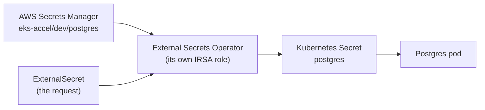

# Episode 8: Secrets

## This episode

Last week we covered Postgres and Redis. Both had a password sitting in a plain Secret file in the repo, which was an acceptable stopgap for a week. Now you do it properly: take every password out of Git and into AWS Secrets Manager, then have the cluster pull it in at runtime so no secret is ever committed.

This is covered by the project line:

> Secrets come from AWS Secrets Manager, nothing sensitive is committed to Git.

> The tool that does the pulling is the External Secrets Operator. You give it its own AWS identity, the same IRSA idea from EP6, so it can read Secrets Manager and nothing else can.

## Secrets, plainly

New to this? Start here.

**A secret is any value that would hurt you if it leaked.** A database password, an API key, a token. The app needs it at runtime, but nobody should be able to read it out of your source code.

**A Kubernetes Secret is not encrypted.** This trips everyone up. A `Secret` object looks special, but its values are only **base64 encoded**, which is not encryption, it is just a different way of writing the same characters. Anyone who can read the YAML can decode it in one command:

```bash
echo 'czNjcjN0' | base64 -d      # s3cr3t
```

So a Secret committed to Git is a password committed to Git. Deleting it later does not help, because it is in the history forever. The rule is simple: the real value never goes in the repo.

**Where does it go instead?** One secure place outside Git, built for this: **AWS Secrets Manager**. You store the real password there once. Then, instead of writing the Secret yourself, something inside the cluster reads it from Secrets Manager and creates the Kubernetes Secret for you, at runtime. That something is the External Secrets Operator. Wiring it up is tonight.

## By the end of this, you will have:

- The real Postgres and Valkey passwords in AWS Secrets Manager, not in the repo.
- The External Secrets Operator running, with its own IRSA role scoped to just your secrets.
- `ExternalSecret` objects that rebuild the `postgres` and `valkey` Secrets from EP7, at runtime.
- A rotation you can watch: change the password in one place and see the cluster follow.

## Prerequisites

- Your EP7 cluster, with Postgres and Valkey running.
- The OIDC provider from EP6 still in place. The operator's role reuses it.
- `helm` installed.

> New to this? Warm up on the local lab in [`lab/`](lab/README.md) first. It runs the whole flow on Kind with LocalStack standing in for Secrets Manager, so you can break things safely with no AWS account.

## The problem



Read two things off this. The operator is the only thing that talks to Secrets Manager, so it needs an identity to do so. The app never changes: it still mounts a normal Kubernetes Secret called `postgres`, it just no longer knows or cares where the value came from.

## 1. Why the password cannot live in Git

Say it plainly to the room: a Secret in a manifest is a password in your repo. base64 is not a lock, it is an envelope with a glass window. Once it is committed it is in the Git history for good, so rotating it later still leaves the old one sitting in the log.

The fix is to never put the value there. The manifest describes *where to get* the secret rather than the secret itself. That is what the next objects do.

## 2. Three objects do the work

The External Secrets Operator adds two new object types, plus a third you already know:

- A **SecretStore** says *where secrets come from*. Here that is AWS Secrets Manager in your region. You write it once.
- An **ExternalSecret** is *the request*: take this key out of Secrets Manager, pull out these fields and make a Kubernetes Secret named `postgres`. It also sets how often to recheck the source.
- The **Secret** is the ordinary Kubernetes Secret the operator creates and keeps in step. Your StatefulSet mounts it exactly like it did in EP7, so nothing on the app side changes.

The whole point: you write the SecretStore and the ExternalSecret, both safe to commit, because neither one contains a password. The operator writes the Secret that does.

## 3. The operator needs its own identity

The operator has to call AWS to read Secrets Manager, so it needs permission. This is the same lesson as the EP6 storage driver: give the software its own IRSA role, do not hand it a static key.

The `terraform/modules/external-secrets` module builds one role, trusted only by the operator's controller service account through the cluster OIDC provider, and allowed to do only two things (`GetSecretValue` and `DescribeSecret`) and only on the `eks-accel/dev/` secrets. Annotate that role onto the operator's service account when you install it, and the SecretStore needs no keys at all.

> **The line that earns the mark on identity.** The operator reads Secrets Manager through its own IRSA role, scoped by a trust policy to one service account and by an IAM policy to one secret prefix. No access keys exist anywhere in the cluster.

## 4. External Secrets Operator or Secrets Store CSI Driver

There are two common ways to get a Secrets Manager value into a pod. This is the decision to defend.

| | External Secrets Operator | Secrets Store CSI Driver |
|---|---|---|
| How the app sees it | a normal Kubernetes Secret | files mounted into the pod |
| Works with existing `secretKeyRef` | yes, unchanged | no, the app must read files |
| A Secret object exists in the cluster | yes | only if you ask it to |
| Best for | apps that already read Secrets | apps that read secrets from disk |

**Verdict: External Secrets Operator for this project.** Your EP7 StatefulSets already read their password from a Secret with `secretKeyRef`. The operator produces exactly that, so the app does not change at all. The CSI driver mounts secrets as files, which is a nice property (no Secret object sitting in etcd) but it means changing how every app reads its config. The trade is not worth it here.

## Deep dive: rotate it, then break it

Sync a secret, then prove the two things that matter: that it keeps itself up to date, then that it fails safely when the identity is wrong.

```bash
# rotate the password at the source
aws secretsmanager put-secret-value --secret-id eks-accel/dev/postgres \
  --secret-string '{"username":"app","dbname":"app","password":"new-one"}'

# within the refresh interval, the Kubernetes Secret updates on its own
kubectl get secret postgres -o jsonpath='{.data.POSTGRES_PASSWORD}' | base64 -d ; echo
```

### Now break it on purpose

Point the operator's role at the wrong service account, or drop the `GetSecretValue` permission, and re-sync:

```bash
kubectl describe externalsecret postgres | tail
# ... AccessDenied ... is not authorized to perform: secretsmanager:GetSecretValue
```

Read that slowly. The operator asked AWS for the value. AWS said no, because the role is not allowed. That is least privilege doing its job. Put it back and the sync recovers.

## Pitfalls

- **Committing the Secret anyway.** The whole episode is undone if someone commits the synced Secret or a plain one next to it. Delete the EP7 placeholder `secret.yaml` files once the ExternalSecrets own those names.
- **The role allowed too much.** `secretsmanager:*` on `*` works and is wrong. Scope to `GetSecretValue`, `DescribeSecret` and the one secret prefix, or the live review marks you down.
- **Two things owning one Secret.** If a plain Secret and an ExternalSecret both target `postgres`, they fight. Pick one owner.
- **The source secret does not exist yet.** The operator reads, it does not invent. Create the secret in Secrets Manager before the ExternalSecret, otherwise it sits in `SecretSyncError`.
- **Refresh interval too tight.** A 10 second refresh on hundreds of secrets hammers the Secrets Manager API. Minutes or hours is normal, seconds is only for a demo.

## Homework

1. **Put your real Postgres and Valkey passwords in Secrets Manager.** One secret each, under the `eks-accel/dev/` prefix.
2. **Build the external-secrets module.** Its own IRSA role, scoped to `GetSecretValue` and `DescribeSecret` on your prefix only. No wildcards.
3. **Install the operator** with the role annotated onto its service account, then apply the SecretStore and the two ExternalSecrets.
4. **Delete the EP7 placeholder Secret files** and show Postgres and Valkey still come up, now with nothing sensitive in the repo.
5. **Rotate one password** in Secrets Manager and show the Kubernetes Secret following, then break the role and capture the `AccessDenied`.

Bring a cluster where `git grep` finds no password and the pods are running on secrets that came from Secrets Manager.

## Appendix A: CoderCo's Technical Vocab (CTV) Dictionary

Skip what you know.

- **Secret (Kubernetes)**: an object holding config that should not be public. Values are base64 encoded, not encrypted.
- **base64**: a way of writing binary as text. Reversible by anyone, so it is encoding, not security.
- **AWS Secrets Manager**: a managed AWS service that stores secrets securely, with versioning and rotation.
- **External Secrets Operator**: software in the cluster that reads an external store and builds Kubernetes Secrets from it.
- **SecretStore**: the object that says where secrets come from, for example Secrets Manager in a region.
- **ExternalSecret**: the object that says which secret to pull and which Kubernetes Secret to create from it.
- **refreshInterval**: how often the operator rechecks the source and updates the Secret.
- **IRSA**: giving a pod its own AWS role through the cluster OIDC provider, from EP6. The operator uses one.
- **Rotation**: changing a secret's value at the source. With this setup the cluster picks up the new value on its own.
