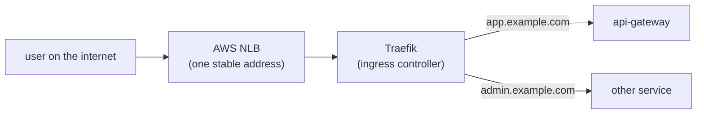

# Episode 9: Ingress and the NLB

## This episode

Everything you have built runs inside the cluster and only talks to itself. Tonight you give it a front door. A user on the internet types your address and reaches the api-gateway, through a load balancer at the edge and a router inside the cluster. This is the first time the platform is reachable from outside.

This delivers the project line:

> Traffic enters through Traefik as the ingress controller, fronted by an AWS Network Load Balancer.

> The load balancer is the one stable public address. Traefik, sitting behind it, reads each request and sends it to the right service.

## Getting traffic in, plainly

New to this? Start here.

By default a pod is only reachable from inside the cluster. To understand how traffic gets in, you need the three ways a Service can be exposed, from most private to most public:

- **ClusterIP** is the default. An address that only works inside the cluster. Great for one service calling another, useless from the internet.
- **NodePort** opens the same port on every node. It works from outside but it is raw: high-numbered ports, no names, no HTTPS. You would not hand this to a user.
- **LoadBalancer** asks the cloud for a real load balancer with a stable address out front. On AWS that is an ELB. This is how public traffic actually arrives.

That gets traffic to *one* service. But you have nine of them. Nine load balancers means nine bills plus nine DNS names you do not want. You want one front door that looks at each request and decides where it goes. That is **Ingress**.

- An **Ingress** is a set of routing rules: "send `app.example.com` to the api-gateway, send `admin.example.com` to the admin service".
- Those rules do nothing on their own. You need an **ingress controller**, a program running in the cluster that reads the Ingress rules and actually routes the traffic. **Traefik** is the one this project uses.

So the shape is: one load balancer takes all the traffic and hands it to Traefik, which uses the Ingress rules to pick the service. One front door, many services behind it.

## By the end of this, you will have:

- Traefik running as the ingress controller.
- An AWS NLB in front of it, giving one stable public address.
- An Ingress routing your hostname to the api-gateway.
- A request from your laptop reaching a pod, with proof the route survives a pod restart.

## Prerequisites

- Your EP8 cluster, with the services running.
- The AWS Load Balancer Controller installed. If it is missing, `k8s/README.md` has the note to add it.
- The EP3 public-subnet tags in place, so the controller has somewhere to put the NLB.

> New to this? Warm up on the local lab in [`lab/`](lab/README.md) first. It runs Traefik and host-based routing on Kind, with a port mapping standing in for the NLB, so you can see it all with no AWS account.

## The problem



Read two things off this. The NLB is the single public address. It does not care about hostnames or paths, it just forwards. Traefik is where the routing decision happens, by reading the Ingress rules.

## 1. Layer 4 and layer 7, the one distinction you need

The load balancer and Traefik work at different levels. Knowing which is which explains the whole design.

- **Layer 4** is TCP. It moves bytes from A to B fast and cheap, without reading them. It has no idea what a hostname or a URL path is. An **NLB** is layer 4.
- **Layer 7** is HTTP. It reads the request: the hostname, the path, the headers. Routing by `app.example.com` versus `admin.example.com` is a layer-7 decision. **Traefik** is layer 7.

So the NLB gets the traffic into the cluster cheaply, then Traefik makes the smart routing choice once it is inside. Each does the job it is good at.

## 2. Traefik, the ingress controller

Traefik runs as pods in the cluster, watches every Ingress object you create and turns those rules into live routing. You install it once with Helm. From then on, exposing a new service is just another Ingress rule, no new load balancer, no new DNS name.

In the lab you reach Traefik through a Kind port mapping. On EKS you put an NLB in front of it, which is the next decision.

## 3. NLB or ALB

This is the decision to defend. Both are AWS load balancers that can sit in front of the cluster, but they split the work differently.

| | NLB (this project) | ALB |
|---|---|---|
| Layer | 4, TCP | 7, HTTP |
| Does the HTTP routing | no, Traefik does | yes, the ALB itself |
| Then why run Traefik | Traefik does all layer-7 | Traefik becomes redundant |
| Cost and speed | cheaper, very fast | pricier per rule |
| Best for | one entrypoint, routing in-cluster | no ingress controller, routing in AWS |

**Verdict: an NLB with Traefik behind it.** The NLB is a cheap, fast layer-4 pipe. Traefik does the layer-7 routing inside the cluster. That keeps your routing rules as Kubernetes Ingress objects, portable and version-controlled, rather than as AWS load-balancer config. An ALB does the HTTP routing itself, which is fine, but then Traefik has nothing to do and you have split your routing between AWS and the cluster. Pick one place for routing. For this project that is Traefik.

> **The line that earns the mark on ingress.** One NLB is the stable public address. Traefik behind it does all the host and path routing from Kubernetes Ingress objects. The NLB stays layer 4 and cheap. The routing lives in the cluster where the rest of your config does.

## 4. The NLB comes from a Service, not by hand

You do not click an NLB into existence. You give the Traefik Service `type: LoadBalancer` with a few annotations, then the AWS Load Balancer Controller notices and builds the NLB for you. The annotations ask for an internet-facing NLB with `target-type: ip`, so it points straight at the Traefik pods through the VPC CNI rather than at node ports. The controller finds where to put it using the public-subnet tags you set in EP3.

## Deep dive: trace the hop, then break it

Send a request and follow it, then prove the route is resilient.

```bash
# find the public address the NLB gave you
kubectl -n traefik get svc traefik
NLB=$(kubectl -n traefik get svc traefik -o jsonpath='{.status.loadBalancer.ingress[0].hostname}')

# the request goes NLB -> Traefik -> api-gateway pod
curl -H "Host: app.example.com" "http://$NLB/"
```

### Now break it on purpose

```bash
# kill the Traefik pod that just served you
kubectl -n traefik delete pod -l app.kubernetes.io/name=traefik

# the NLB address has not changed; once a new Traefik pod is up the route returns
curl -H "Host: app.example.com" "http://$NLB/"
```

The public address stayed put while the pod behind it was replaced. That separation, a stable edge and disposable routers, is the point of putting a load balancer in front.

## Pitfalls

- **No public-subnet tags.** Without `kubernetes.io/role/elb` on the public subnets, the controller cannot place the NLB and the Service sits `<pending>` forever. This is the commonest ingress bug on EKS, and it traces back to EP3.
- **The Load Balancer Controller is not installed.** A `LoadBalancer` Service does nothing without it. The EXTERNAL-IP never arrives. Install it with its own IRSA role first.
- **`target-type: instance` instead of `ip`.** Instance mode routes through node ports and adds a hop. With the VPC CNI you want `ip`, straight to the pods.
- **One Traefik replica.** A single ingress pod is a single point for every route. Run at least two with a disruption budget, so a node drain does not black out the whole platform.
- **Security group blocks the health check.** If the NLB cannot health-check the Traefik targets, every request fails at the edge. Check the group allows the health-check port.

## Homework

1. **Install Traefik** as your ingress controller, with at least two replicas.
2. **Front it with an NLB** by setting the Traefik Service to `type: LoadBalancer` with the NLB annotations, then confirm an EXTERNAL-IP arrives.
3. **Add an Ingress** routing your hostname to the api-gateway.
4. **Reach a pod from your laptop** with a `curl` to the NLB, using the `Host:` header until DNS is wired in EP10.
5. **Delete the Traefik pod** and show the NLB address is unchanged and the route recovers.

Bring a cluster where one `curl` to the NLB reaches the api-gateway. Write the paragraph for your project README that answers the NLB-versus-ALB question. That paragraph is the artefact the live review grades.

## Appendix A: CoderCo's Technical Vocab (CTV) Dictionary

Skip what you know.

- **Ingress**: a set of routing rules for HTTP traffic entering the cluster, by hostname and path.
- **Ingress controller**: the program that reads Ingress rules and does the routing. Traefik here.
- **Traefik**: the ingress controller this project uses. Runs as pods, does layer-7 routing.
- **Service type ClusterIP**: reachable only inside the cluster. The default.
- **Service type NodePort**: opens a port on every node. Works from outside, but raw.
- **Service type LoadBalancer**: asks the cloud for a real load balancer with a stable address.
- **NLB (Network Load Balancer)**: an AWS layer-4 load balancer. Fast, cheap, does not read HTTP.
- **ALB (Application Load Balancer)**: an AWS layer-7 load balancer. Reads HTTP, routes by host and path.
- **Layer 4 / layer 7**: TCP (bytes) versus HTTP (hostnames, paths, headers).
- **AWS Load Balancer Controller**: the in-cluster controller that turns a LoadBalancer Service into a real NLB or ALB.
- **target-type ip**: the load balancer points straight at pod IPs through the VPC CNI, with no node-port hop.

See you in episode 10, where the front door gets a real name and a padlock: DNS with ExternalDNS and HTTPS with cert-manager.
