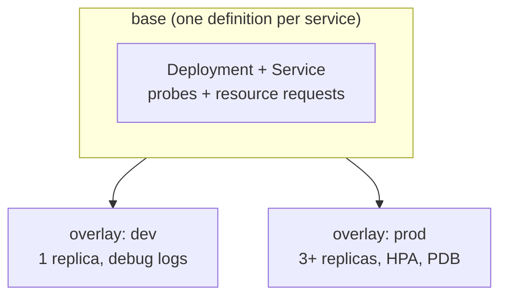

# Episode 9: Application manifests, probes and autoscaling

## This episode

We have a cluster with storage, secrets and identity, but our nine services are still running from whatever we hand-applied along the way. In this episode we give them a proper home. Every service becomes a Deployment with health checks and resource requests, the busy ones get autoscaling, then we manage the whole set with Kustomize so dev and prod share one base.

This delivers the project line:

> All nine services run as Deployments, health-checked, resource-bounded and autoscaled, with per-environment config through Kustomize.

> A Deployment tells Kubernetes what healthy looks like and how much the pod needs, then Kubernetes keeps it that way on its own.

## Deployments, probes and resources, plainly

New to this? Start here. Four ideas carry the session.

**A Deployment keeps a set of identical pods running.** We say "run three copies of api-gateway" and the Deployment makes it so. A pod dies, it makes another. We change the image, it rolls the pods over to the new version a few at a time. It is the standard way to run a stateless service.

**A probe is a health check Kubernetes runs for us.** Two of them matter here:

- A **readiness probe** answers "can this pod take traffic yet?". Until it passes, the pod gets no requests. This is how a slow-starting service avoids serving errors while it warms up.
- A **liveness probe** answers "is this pod wedged?". If it fails, Kubernetes restarts the pod. This rescues a process that has hung but not crashed.

**A request and a limit size the pod.** The **request** is what the pod is guaranteed, the number the scheduler uses to place it on a node. The **limit** is the ceiling it cannot cross. Requests keep the scheduler honest. Limits stop one greedy pod starving its neighbours.

**Autoscaling adds pods when the work grows.** A **HorizontalPodAutoscaler** watches a metric, usually CPU, then changes the replica count to keep that metric near a target. Traffic doubles, it adds pods. Traffic drops, it removes them. We set the rule once and it runs on its own.

## What we end up with

- Every service as a Deployment with a readiness probe, a liveness probe and resource requests.
- A HorizontalPodAutoscaler on the request-path services.
- One Kustomize base plus a dev and a prod overlay, so environments share a single source.
- A live scale-up: load climbs, pods appear, no hand-editing.

## Prerequisites

- The EP8 cluster, with the services and their secrets in place.
- metrics-server installed, which the HPA needs. The lab has the note to add it.

> New to this? Warm up on the local lab in [`lab/`](lab/README.md) first. It runs a service, a probe, Service DNS and a real HPA scale-up on Kind, so we see autoscaling happen with no AWS account.

## A quick word on Helm

You have probably heard of Helm, so here is where it fits. We use Helm to install other people's software, like the operators from earlier episodes. We use Kustomize for our own services. Kustomize is plain YAML with small patches on top, no templating language to learn, plus it is what ArgoCD reads natively when we reach GitOps later. So the rule is simple: Helm for third-party charts, Kustomize for our apps.

## The problem



Read one thing off this. The base describes each service once. Each environment is a thin layer of differences on top. We never copy a Deployment and edit it per environment.

## 1. The Deployment, probes and resources

Every service gets the same shape. A Deployment that runs the pod, a readiness probe so it only takes traffic when it is ready, a liveness probe so a hung pod is restarted, plus resource requests so the scheduler can place it. The request-path services also get a ClusterIP Service, which is the stable in-cluster name the others call.

One probe mistake is worth calling out, because it turns a slow day into an outage.

> **The pitfall that earns the mark on health checks.** A liveness probe must not depend on the database or another service. If it does, a slow database makes the probe fail, Kubernetes restarts the pod, the restart makes the database load worse. A restart storm follows. Liveness checks the pod itself. Readiness can check dependencies, because a failed readiness only stops traffic, it does not restart anything.

## 2. Requests, limits and the CPU-limit question

Requests are easy. Set them to what the service uses at rest, because that is what the scheduler reserves. Set memory requests and limits close together, since a pod over its memory limit is killed.

CPU is the interesting one. A memory limit protects us, a CPU limit often hurts us. CPU is compressible: a pod over its CPU request is throttled rather than killed, so a CPU limit mostly caps a service that could have used spare capacity for free. For this project we set CPU requests on everything and leave CPU limits off, so a service can burst into idle CPU when it needs to.

## 3. Autoscaling: HPA on CPU, KEDA on the queue

The request-path services scale on CPU with a HorizontalPodAutoscaler. It reads CPU from metrics-server and keeps the average near a target, say 60%, adding and removing pods between a floor and a ceiling.

The **worker** is different, a callback to EP2. It pulls from an SQS queue, so when the backlog grows its CPU barely moves, which means CPU-based autoscaling never reacts. The right signal is the queue depth, so the tool that scales on it is **KEDA**. We wire KEDA to the worker later in the series. For now, the point is that CPU is the wrong metric for a queue consumer.

> **The line that earns the mark on autoscaling.** Scale request-path services on CPU with an HPA. Scale the queue worker on backlog with KEDA, because an idle-looking consumer with a growing queue never trips a CPU threshold.

## 4. Kustomize: one base, thin overlays

We have two environments and nine services. Copying eighteen sets of manifests and keeping them in step by hand is how drift starts. Kustomize fixes this: a **base** describes each service once, then an **overlay** per environment lists only the differences.

- The **base** has the Deployments, Services and a shared ConfigMap, all at sensible defaults.
- The **dev overlay** sets the `shop-dev` namespace, one replica each and debug logging.
- The **prod overlay** sets `shop-prod`, more replicas on the busy services, the real image tag, an HPA and a PodDisruptionBudget.

We build an environment with one command and nothing is duplicated:

```bash
kubectl kustomize manifests/overlays/dev     # or apply with: kubectl apply -k
kubectl apply -k manifests/overlays/prod
```

An overlay is a patch rather than a copy. Change the base once and both environments pick it up.

## Deep dive: deploy, reach, then scale under load

```bash
# stand up the dev environment
kubectl apply -k manifests/overlays/dev
kubectl get deploy,svc

# one service reaches another by its Service name, never an IP
kubectl run tmp --rm -it --image=busybox:1.36 --restart=Never -- \
  wget -q -O- http://api-gateway/healthz
```

### Now break it on purpose

We put load on the api-gateway and watch the HPA react:

```bash
# drive CPU up
kubectl apply -f lab/manifests/loadgen.yaml
kubectl get hpa api-gateway -w
# cpu climbs past the target, replicas rise from 1 towards the max

# stop the load; after a few minutes the pods scale back down
kubectl delete -f lab/manifests/loadgen.yaml
```

We never touched the replica count. The HPA did it, off a metric.

## Pitfalls

- **Liveness on the database path.** The restart-storm above. Keep liveness cheap and local, then let readiness carry the dependency checks.
- **No resource requests.** With no request, the scheduler treats the pod as needing nothing and packs it anywhere, then nodes get oversubscribed and everything slows. Set a request on every container.
- **An HPA with no metrics-server.** The HPA shows `<unknown>` for the metric and never scales. Install metrics-server first.
- **CPU limits set too tight.** A service throttled at its CPU limit looks slow for no visible reason. Prefer a CPU request and no CPU limit.
- **Editing the base for one environment.** The moment a per-environment value lands in the base, both environments get it. That difference belongs in an overlay.
- **HPA and a fixed replica count fighting.** If a Deployment sets `replicas` and an HPA also manages it, they tug against each other. Let the HPA own the count.

## Homework

1. **Write the base.** All nine services as Deployments with a readiness probe, a liveness probe and resource requests. The request-path ones get a Service too.
2. **Add the two overlays.** A dev overlay (one replica, debug logs) and a prod overlay (more replicas, real image tag, an HPA on the api-gateway, a PDB).
3. **Prove Kustomize.** Run `kubectl kustomize` on both overlays and show dev and prod differ only where they should.
4. **Show an autoscale.** Put load on a service and capture the HPA raising the replica count, then the scale back down.
5. **Explain the worker.** Write two sentences on why the worker scales on queue depth with KEDA rather than on CPU.

Bring a cluster where `kubectl apply -k` stands up the dev environment and one service scales under load. The Kustomize base is the artefact the live review grades.

## Appendix A: CoderCo's Technical Vocab (CTV) Dictionary

Skip what you know.

- **Deployment**: keeps a set of identical pods running, rolling them over on a change.
- **ReplicaSet**: the object a Deployment uses under the hood to hold the replica count. We rarely touch it.
- **Readiness probe**: decides whether a pod may receive traffic. Failing it stops traffic, nothing more.
- **Liveness probe**: decides whether a wedged pod should be restarted. Failing it restarts the pod.
- **Resource request**: what a container is guaranteed, the number the scheduler places on.
- **Resource limit**: the ceiling a container cannot cross. Over the memory limit is a kill, over the CPU limit is a throttle.
- **HorizontalPodAutoscaler (HPA)**: changes the replica count to keep a metric, usually CPU, near a target.
- **metrics-server**: the component that supplies the CPU and memory readings the HPA needs.
- **KEDA**: an autoscaler that scales on external signals like queue depth. The right tool for the worker.
- **Kustomize**: layers per-environment overlays on a shared base of manifests, with no templating.
- **Overlay**: an environment's set of differences from the base.
- **PodDisruptionBudget (PDB)**: a floor on how many pods stay up during a voluntary disruption like a node drain.

See you in episode 10, where the front door gets a real name and a padlock: ingress with an NLB, DNS and HTTPS.
