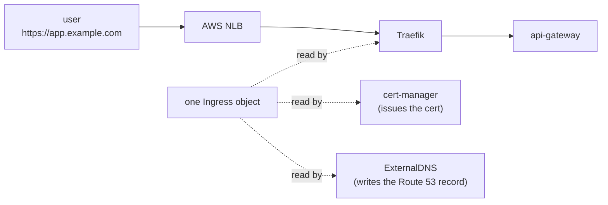
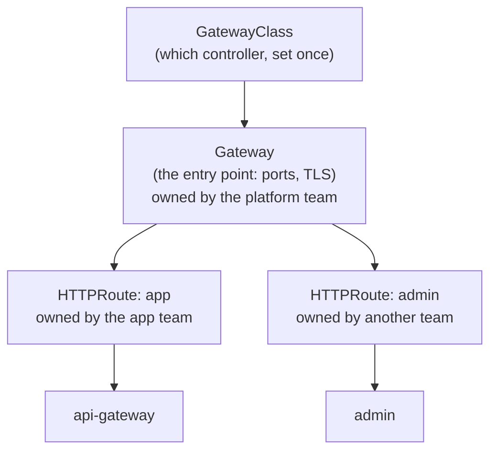

# Episode 10: Ingress, DNS and HTTPS

## This episode

Everything runs inside the cluster and only talks to itself. In this episode we give the platform a real front door. A user types `https://app.<our-domain>`, gets a valid certificate and reaches the api-gateway, with plain HTTP redirected to HTTPS. This is the first time the platform is reachable from the internet, with a real name and a padlock.

This delivers the project line:

> The platform is reachable at `https://app.<domain>` with a valid certificate, HTTP redirects to HTTPS, DNS managed automatically.

> Four pieces do this: Traefik routes the traffic, an NLB is the public address, cert-manager gets the certificate, ExternalDNS makes the DNS record. One Ingress object drives all four.

## The front door, plainly

New to this? Start here. Four jobs have to happen for `https://app.example.com` to work, each with its own tool.

- **Get traffic into the cluster.** A load balancer with a stable public address. We use an **NLB**, then inside the cluster **Traefik** routes each request to the right service. This is the ingress part.
- **Give it a name.** A DNS record so `app.example.com` points at that load balancer. **ExternalDNS** writes it into Route 53 for us.
- **Give it a padlock.** A TLS certificate so the browser trusts it and the traffic is encrypted. **cert-manager** gets one from **Let's Encrypt**, free, then renews it before it expires.
- **Force the padlock.** Redirect plain HTTP to HTTPS, so nobody talks to us in the clear.

The neat part: we describe all of this with **one Ingress object**. Traefik reads it to route, cert-manager reads it to get the cert, ExternalDNS reads it to make the record. We write the rule once, the controllers do the rest.

## What we end up with

- Traefik as the ingress controller, behind an NLB, giving one public address.
- cert-manager issuing a Let's Encrypt certificate, renewed automatically.
- ExternalDNS creating the Route 53 record for our hostname.
- `https://app.<our-domain>` serving the api-gateway, with HTTP redirecting to HTTPS.

## Prerequisites

- The EP9 cluster, with the services running.
- The AWS Load Balancer Controller installed. Callback to EP3: the public subnets need the `kubernetes.io/role/elb` tags, or the NLB has nowhere to go.
- A Route 53 hosted zone for your domain.

> New to this? Warm up on the local lab in [`lab/`](lab/README.md) first. It runs Traefik, cert-manager and HTTPS on Kind, with a local CA standing in for Let's Encrypt, so you see the whole flow with no AWS account.

## The problem



Read one thing off this. The top row is the request path: a user reaches the api-gateway through the NLB and Traefik. Underneath, the one Ingress object is read by three controllers, each doing its own job, so we never wire routing, certs and DNS separately.

## 1. Traefik behind an NLB

Same as the ingress you already know. Traefik runs as pods and does the layer-7 routing. In front of it we put an NLB, a cheap fast layer-4 load balancer, by giving the Traefik Service `type: LoadBalancer` with the NLB annotations. The AWS Load Balancer Controller sees that and builds the NLB, placing it in the public subnets it finds by their EP3 tags.

> **Do not use ingress-nginx.** Every old tutorial reaches for it. It went into maintenance-only in 2025 and is being retired, so we use Traefik, which is current and does everything this project needs.

## 2. cert-manager and the DNS-01 challenge

cert-manager gets certificates from Let's Encrypt, for free, then renews them on its own before they expire. To hand us a certificate, Let's Encrypt first makes us prove we own the domain. That proof is a **challenge**. There are two kinds:

- **HTTP-01** puts a token at a URL on the site. Simple, but it needs the site already reachable on port 80, and it cannot do wildcards.
- **DNS-01** puts a token in a DNS TXT record. It works before the site is public and it can issue wildcards, at the cost of letting cert-manager write to our DNS.

We use **DNS-01**, because it issues before anything is live and it handles a wildcard if we want one. cert-manager writes the TXT record into Route 53 through its own IRSA role, the same identity pattern as EP6 and EP8. No keys.

> **The line that earns the mark on TLS.** cert-manager issues from Let's Encrypt with a Route 53 DNS-01 challenge, reaching Route 53 through its own IRSA role. Certificates renew automatically, and no static credentials exist in the cluster.

## 3. ExternalDNS makes the record

Without it, we would create the DNS record by hand every time a hostname changes. ExternalDNS does it for us: it watches Ingress objects, reads the hostnames, then creates and updates the matching Route 53 records. Point an Ingress at `app.example.com` and the record appears. It reaches Route 53 through its own IRSA role too. A TXT owner record marks the records it owns, so it never touches ones you made by hand.

## 4. One Ingress ties it together

The Ingress carries three things: the host, a TLS block naming the certificate Secret, plus the `cert-manager.io/cluster-issuer` annotation. From that one object, Traefik routes `app.example.com`, cert-manager issues `app-tls`, ExternalDNS publishes the record. The plain-HTTP-to-HTTPS redirect lives once in the Traefik config, so every service is HTTPS by default.

## Deep dive: watch it come together, then break it

```bash
# apply the one Ingress
kubectl apply -f k8s/ingress.yaml

# cert-manager issues the certificate (watch it go Ready)
kubectl get certificate app-tls -w

# ExternalDNS writes the Route 53 record (watch its log)
kubectl -n external-dns logs deploy/external-dns | grep app.example.com

# the payoff
curl https://app.example.com/
```

### Now break it on purpose

```bash
# point cert-manager at a service account its role does not trust, then reissue.
# the challenge fails because it cannot write the Route 53 TXT record:
kubectl describe certificaterequest | tail
# ... AccessDenied ... route53:ChangeResourceRecordSets
```

The certificate never issues, because the identity was wrong. That is least privilege again: each controller can only touch the one zone its role allows.

## Where this is heading: the Gateway API (read after the session)

We used Ingress because every cluster supports it and it is the simplest thing that works. Its successor is the **Gateway API**, a newer set of objects that went stable in 2023. It is worth knowing where the field is going. The push towards it is real now that ingress-nginx, the most common Ingress controller, is being retired.

Here is the shape. Instead of one Ingress object, the Gateway API uses three:



Read two things off it. One **Gateway** is the shared entry point. Each team attaches its own **HTTPRoute** to it, so nobody edits one giant shared object.

### Why it improves on an Ingress controller

- **It splits the one object by who owns it.** An Ingress mixes the entry point and the routing in a single object that everyone edits. The Gateway API splits them: the platform team owns the **Gateway** (the ports, the TLS, the load balancer), while each app team owns its own **HTTPRoute**. Clear ownership, no shared file to fight over.
- **The features live in the spec itself, rather than in annotations.** Anything past basic host and path routing, like splitting traffic for a canary or matching on a header, had to go into controller-specific annotations on an Ingress. Every controller invented its own, so nothing was portable. In the Gateway API these are proper typed fields, the same on any controller.
- **It routes more than HTTP.** The same model handles TCP, UDP and gRPC. It even extends to service-mesh traffic inside the cluster, so its reach goes beyond the traffic arriving from outside.
- **It is portable.** Because the features are standard, moving from one controller to another is a real option rather than rewriting a wall of annotations.

The good news for us: **Traefik already speaks the Gateway API**, so this is a change of objects rather than a change of tool. Other implementations you will hear about are **Envoy Gateway** (the Gateway API built on the Envoy proxy, the same proxy under Istio), plus Istio and Cilium.

When to reach for it: Ingress is still the right baseline for a simple front door like ours. Gateway API earns its keep in bigger setups where many teams share one entry point or where you need canary traffic splitting and header routing without controller-specific annotations.

## Pitfalls

- **Using ingress-nginx.** It is being retired. Pick Traefik.
- **No public-subnet tags.** Without the EP3 `kubernetes.io/role/elb` tags, the NLB has nowhere to land and the Traefik Service sits `<pending>`. The commonest front-door bug, and it traces back to EP3.
- **Testing against Let's Encrypt production.** Production has strict rate limits, so a config typo can lock you out for a week. Issue against the staging server first, then switch to production once it works.
- **cert-manager or ExternalDNS with no IRSA role.** The DNS-01 challenge or the record write fails with `AccessDenied`. Give each its own role scoped to the zone.
- **A too-broad Route 53 policy.** `route53:*` on `*` works and is wrong. Scope `ChangeResourceRecordSets` to the one hosted zone.
- **DNS has not propagated yet.** A fresh record takes a little time to resolve everywhere. If `curl` fails right after ExternalDNS writes it, wait and retry before assuming it is broken.

## Homework

1. **Install Traefik behind an NLB** with the redirect to HTTPS, then confirm an EXTERNAL-IP arrives.
2. **Install cert-manager** with a Let's Encrypt DNS-01 ClusterIssuer, on its own IRSA role. Issue against staging first.
3. **Install ExternalDNS** on its own IRSA role, scoped to your hosted zone.
4. **Apply one Ingress** for the api-gateway and watch the certificate issue and the Route 53 record appear.
5. **Reach `https://app.<your-domain>`** with a valid certificate, then show plain HTTP redirecting to it.

Bring a browser open on `https://app.<your-domain>` with a valid padlock. Write the paragraph for your project README on why DNS-01 over IRSA rather than static keys. That paragraph is the artefact the live review grades.

## Appendix A: CoderCo's Technical Vocab (CTV) Dictionary

Skip what you know.

- **Ingress**: routing rules for HTTP traffic entering the cluster, by hostname and path.
- **Ingress controller**: the program that reads Ingress rules and routes the traffic. Traefik here.
- **NLB**: an AWS layer-4 load balancer. The stable public address in front of Traefik.
- **cert-manager**: an operator that gets and renews TLS certificates, usually from Let's Encrypt.
- **Let's Encrypt**: a free certificate authority that issues short-lived certs over the ACME protocol.
- **ACME**: the protocol cert-manager and Let's Encrypt speak to issue a certificate.
- **Challenge (DNS-01 / HTTP-01)**: how you prove you own a domain. DNS-01 uses a TXT record, HTTP-01 uses a URL.
- **ClusterIssuer**: the cert-manager object that says where certificates come from, for the whole cluster.
- **ExternalDNS**: watches Ingress objects and writes the matching DNS records, here into Route 53.
- **Route 53**: AWS's DNS service.
- **HTTP-to-HTTPS redirect**: bouncing plain HTTP up to HTTPS so nothing is served in the clear.
- **IRSA**: a pod assuming its own AWS role through the cluster OIDC provider. cert-manager and ExternalDNS each use one.
- **Gateway API**: the successor to Ingress. Splits routing into a Gateway (the entry point) and HTTPRoutes (per-app rules), with features in the spec rather than annotations.
- **Envoy Gateway**: a Gateway API implementation built on the Envoy proxy.

See you in episode 11, where we wire the asynchronous spine: the SQS queue, its dead-letter queue and the worker that drains it.
