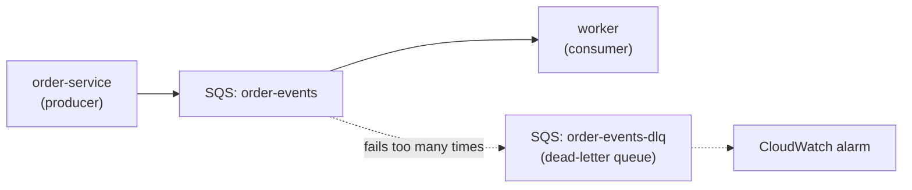

# Episode 11: The event bus

## This episode

The order flow has been synchronous so far: a request comes in, one service does the work and answers. That breaks down once an order needs several services to react, some of them slow. In this episode we add the async spine the app was built for. Orders go onto an SQS queue and a worker drains it. Anything the worker cannot handle ends up in a dead-letter queue instead of blocking everything behind it.

This covers the project task:

> An SQS queue is the event bus, with a dead-letter queue for messages that fail, and the worker consumes it through its own least-privilege role.

> A queue lets the order-service hand off work and move on. It lets the worker take that work at its own pace. The two are no longer tied together.

## Queues and async, plainly

New to this? Start here.

**Synchronous means the caller waits.** The order-service calls payment, waits for the answer, then calls shipping, waits again. If shipping is slow, the whole order is slow. If shipping is down, the order fails. Everything is tied together.

**A queue breaks that tie.** Instead of calling the next service directly, the order-service drops a message on a **queue** and moves on. A **worker** picks messages off the queue and does the slow work whenever it can. The order-service does not wait. A slow or down worker does not fail the order, the message just waits in the queue until the worker is ready.

**On AWS the queue is SQS.** A managed queue you send messages to and receive them from. No servers to run.

**Some messages cannot be handled.** A malformed order, a bug that trips on one record. If the worker keeps failing on the same message, it blocks everything behind it. A **dead-letter queue** (DLQ) is where those bad messages go after a few tries, so the worker can get on with the rest.

So the idea is: producers send to the queue, the worker consumes, then anything that keeps failing drops into the DLQ for someone to look at later.

## What we end up with

- An SQS queue and a dead-letter queue, in our own Terraform.
- The worker consuming the queue, on its own IRSA role scoped to that one queue.
- A message that keeps failing landing in the DLQ instead of blocking the worker.
- A CloudWatch alarm that tells us the moment the DLQ has anything in it.

## Prerequisites

- The EP10 cluster, with the services running.
- The OIDC provider from EP6. The worker role reuses it.

> New to this? Warm up on the local lab in [`lab/`](lab/README.md) first. It runs SQS on Kind with LocalStack, a worker and the whole poison-message-to-DLQ flow, with no AWS account.

## The problem



Read one thing off this. The producer and the worker never talk directly. The queue sits between them, so either side can be slow or restart without breaking the other.

## 1. SQS: standard or FIFO

SQS comes in two flavours. Picking one is the first decision.

- **Standard** is fast and cheap, with no ordering promise and at-least-once delivery. A message is delivered once in almost all cases, and occasionally more than once.
- **FIFO** keeps strict order and delivers exactly once, at lower throughput and a bit more setup.

For this project we use **standard**. Order events do not need strict global ordering, so the extra throughput is free. We deal with the occasional duplicate in the handler, which is the next point.

## 2. At-least-once, so handlers must be idempotent

Standard SQS can deliver the same message more than once. That is expected, the deal you take for the speed. So the worker has to be **idempotent**: handling the same message twice leaves the same result as handling it once. Charge a card by a payment id the worker records, so a duplicate delivery does not charge twice. Idempotency is what makes at-least-once safe.

## 3. The visibility timeout

When the worker receives a message, SQS hides it from other receivers for a set time, the **visibility timeout**. The worker has that long to finish and delete the message. If it finishes, it deletes the message and the message is gone. If it crashes or the timeout passes first, the message becomes visible again and gets retried.

Set the timeout a bit longer than the slowest handling you expect. Too short and a slow-but-fine message gets handed out again while the first worker is still on it, so you do the work twice. Too long and a genuinely stuck message takes ages to come back.

## 4. The dead-letter queue and the redrive policy

The DLQ is a second queue with one job: hold the messages the worker keeps failing on. The main queue has a **redrive policy** that says "after a message has been received `maxReceiveCount` times without being deleted, move it to the DLQ". That count is the number of tries before we give up.

Without a DLQ, a single poison message loops forever: received, fails, comes back, fails, blocking the worker and burning money. With one, the bad message steps aside after a few tries and the worker keeps going.

> **The line that earns the mark on the event bus.** A standard SQS queue with a dead-letter queue behind it. The redrive policy parks a poison message after a few tries so it stops blocking the worker. A CloudWatch alarm on the DLQ tells us the moment something failed.

## 5. IRSA per service, not one big role

The worker needs to read the queue, so it needs permission. Same lesson as the storage driver in EP6: give the worker its own IRSA role, scoped to receive and delete on this one queue. Nothing wider.

And keep it separate from the producers. The order-service needs `sqs:SendMessage`, the worker needs receive and delete, so they get different roles. If the worker is ever compromised, it can drain one queue and no more. One shared `sqs:*` role would hand an attacker every queue in the account.

> **The line that earns the mark on identity.** Each service gets its own IRSA role with only the SQS actions it uses, on only the queues it touches. The worker cannot send and the producer cannot receive, so neither can reach another queue.

## 6. Alerting on the DLQ

A DLQ is useless if nobody looks at it. Nobody looks until something breaks. So we point a CloudWatch alarm at the DLQ's message count and have it fire the moment the count goes above zero. A message in the DLQ means an order failed every retry, which is worth waking someone for.

## The Strimzi fork in the road

The brief lets you swap SQS for Kafka, run in-cluster with Strimzi, if you defend it. Be honest about the cost. Kafka gives you real streaming, replay and ordered partitions, which this project does not need. In exchange you run and patch the brokers, size the storage, handle rebalancing and rewire every producing service to a Kafka client. SQS is a managed queue with a DLQ built in and nothing to run. For this workload SQS is the right call. Kafka is a much bigger commitment than it looks.

## Deep dive: send a good message, then a poison one

```bash
# a good message: the worker handles it and deletes it
aws sqs send-message --queue-url "$QUEUE_URL" \
  --message-body '{"order":123,"status":"paid"}'
kubectl logs deploy/worker | tail
# processed: {"order":123,"status":"paid"}
```

### Now break it on purpose

```bash
# a message the worker keeps failing on
aws sqs send-message --queue-url "$QUEUE_URL" \
  --message-body '{"order":666,"status":"bad"}'

# watch it retry, then check the DLQ
kubectl logs deploy/worker -f
# FAILED to process ... (leaving it for retry)   x3
aws sqs get-queue-attributes --queue-url "$DLQ_URL" \
  --attribute-names ApproximateNumberOfMessages
# ApproximateNumberOfMessages: 1
```

The bad message tried a few times, then stepped aside into the DLQ. The worker never got stuck. The alarm has fired. That is the whole reason a DLQ exists.

## Pitfalls

- **Giving the worker `sqs:*`.** It only needs receive and delete on one queue. A wildcard hands an attacker every queue in the account. Scope it.
- **Skipping the DLQ "because it is dev".** A poison message with no DLQ loops forever and blocks the worker. The DLQ costs nothing. Always have one.
- **Assuming exactly-once.** Standard SQS is at-least-once. A non-idempotent handler double-charges on a duplicate. Make the handler idempotent.
- **A visibility timeout shorter than the work.** The message gets handed out again while the first worker is still on it, so the work runs twice. Set it longer than the slowest handling.
- **A DLQ with no alarm.** Messages pile up unseen. Alarm on the DLQ depth so a failure is loud.
- **Deleting a message before the work is done.** Delete only after the handler succeeds. Delete too early and a crash loses the message for good.

## Homework

1. **Build the events module.** A queue, a DLQ, a redrive policy and a CloudWatch alarm on the DLQ.
2. **Give the worker its own IRSA role**, scoped to receive and delete on the one queue. No wildcards.
3. **Give a producer its own role** with `sqs:SendMessage`, separate from the worker's.
4. **Send a good message** and show the worker handling it.
5. **Send a poison message** and show it landing in the DLQ after its retries, then read it back.

Bring a cluster where a poison message ends up in the DLQ and the alarm fires. Write the paragraph for your project README on why SQS over Kafka here. That paragraph is the artefact the live review grades.

## Appendix A: CoderCo's Technical Vocab (CTV) Dictionary

Skip what you know.

- **Queue**: a place to drop messages so another process can pick them up later.
- **SQS**: AWS's managed message queue.
- **Producer**: a service that sends messages to the queue.
- **Consumer / worker**: a service that receives and handles messages.
- **Standard queue**: fast, no strict order, at-least-once delivery.
- **FIFO queue**: strict order and exactly-once, at lower throughput.
- **At-least-once**: a message arrives one or more times, so handlers must be idempotent.
- **Idempotent**: handling the same message twice gives the same result as once.
- **Visibility timeout**: how long a received message is hidden while the worker handles it.
- **Long polling**: waiting a few seconds for a message rather than asking again and again.
- **Dead-letter queue (DLQ)**: where messages go after they have failed too many times.
- **Redrive policy**: the rule that says how many tries before a message moves to the DLQ.
- **IRSA**: a pod assuming its own AWS role through the OIDC provider. The worker uses one.

See you in episode 12, where we build the pipeline that ships all this: GitHub Actions with OIDC, building and scanning images with no long-lived keys.
